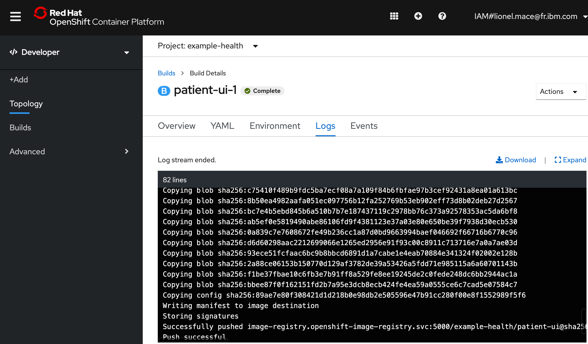

# Exercise 2: Logging and monitoring

In this exercise, we'll explore the out-of-the-box logging and monitoring capabilities that are offered in OpenShift.

## Simulate Load on the Application

First, let's simulate some load on our application. Run the following script which will endlessly spam our app with requests:

> With Linux/MacOS
>
> ```bash
> while sleep 1; do curl -s <your_app_route>/info; done
> ```
>
> With Windows
>
> ```bash
> while($true){curl <your_app_route>/info}
> ```


Note: Retrieve the external URL from the OpenShift console, or from the URL of your Example Health application. Note that there may be an `/index.html` at the end that you need to replace with `/info`. We're hitting the /info endpoint which will trigger some logs from our app. For example:

[`http://patient-ui-health-example.myopenshift-xxx.us-east.containers.appdomain.cloud/info`](http://patient-ui-health-example.myopenshift-341665-66631af3eb2bd8030c5bb56d415b8851-0001.us-east.containers.appdomain.cloud/jee.html)


## OpenShift Logging

Since we only created one pod, seeing our logs will be straight forward. Ensure that you're in the **Developer** view, and navigate to **Topology**. You should see a single deployment config. Click that to see your Pods, Builds, Services and Routes.

* **Pods**: Your Node.js application containers
* **Builds**: The auto-generated build that created a Docker image from your Node.js source code, deployed it to the OpenShift container registry, and kicked off your deployment config.
* **Services**: Tells OpenShift how to access your Pods by grouping them together as a service and defining the port to listen to
* **Routes**: Exposes your services to the outside world using the LoadBalancer provided by the IBM Cloud network

  

1. Click on **View Logs** next to your Pods to see streaming logs from your running application. If you're still generating traffic, you should see log messages for every request being made.

   

2. Click on **View Logs** next to your completed Build. This shows you the process that OpenShift took to install the dependencies for your Node.js application and build/push a Docker image.

   

## OpenShift Terminal

One of the great things about Kubernetes is the ability to quickly debug your application pods with SSH terminals. This is great for development, but generally is not recommended in production environments. OpenShift makes it even easier by allowing you to launch a terminal directly in the dashboard.

1. Navigate to your Pod by clicking on your Deployment Config, then clicking the name of the Pod under **Pods**.

   

2. Switch to the `Terminal` tab, and run the following commands.

   > This command shows you the the project files.
   >
   > ```text
   >  ls
   > ```
   >
   > This command shows you the running processes.
   >
   > ```text
   >  ps aux
   > ```

   

## OpenShift Monitoring

When deploying new apps, making configuration changes, or simply inspecting the state of your cluster, the Project-scope Dashboard gives Developer Clear Insights. Access the **Dashboard** now by going to the `Advanced > Project Details` tab on the left side menu.


You can also dive in a bit deeper - the `Events` view is useful for identifying the timeline of events and finding potential error messages. When tracking the state of a new rollout, managing existing assets, or even something simple like exposing a route, the Events view is critical in identifying the timeline of activity. This becomes even more useful when considering that multiple operators may be working against a single cluster.


You'll want to refer to this view throughout the lab. Almost all actions we take in in OpenShift will result in an event being fired in this view. As it is updated real-time, it's a great way to track changes to state.

