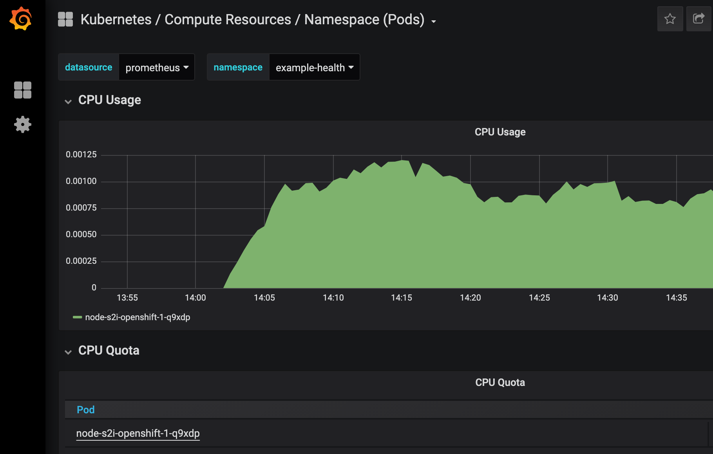

# Exercise 3: Metrics and dashboards

In this exercise, we'll explore the third-party monitoring and metrics dashboards that are installed for free with OpenShift!

## Grafana

Red Hat OpenShift on IBM Cloud comes with [Grafana](https://grafana.com/) preinstalled. Get started by switching to the `Administrator` perspective:

Then Navigate to `Monitoring > Dashboards` in the left-hand bar. You'll be asked to login with OpenShift and then click through some permissions.

You should then see your Grafana dashboard. Hit `Home` on the top left, and choose `Kubernetes / Compute Resources / Namespace (Pods)`.

Choose the name of the project you created in [Step 1](https://github.com/svennam92/openshift101/tree/53e9a4199e235447a4a128841ee528898f061b7c/workshop/exercise-3/exercise-2.md#deploy-example-health) - the same one that your application is running inside.

You should be able to see the CPU and Memory usage for your application. In production environments, this is helpful for identifying the average amount of CPU or Memory your application uses, especially as it can fluctuate through the day. We'll use this information in the next exercise to set up auto-scaling for our pods.

## Prometheus and Alert Manager

Navigating back to the cluster console, you can also launch:

* [**Prometheus**](https://prometheus.io/) - a monitoring system with an efficient time series database
* [**Alertmanager**](https://prometheus.io/docs/alerting/alertmanager/) - an extension of Prometheus focused on managing alerts

## Prometheus

OpenShift provides a web interface to Prometheus, which enables you to run Prometheus Query Language \(PromQL\) queries and examine the metrics visualized on a plot. This functionality provides an extensive overview of the cluster state and enables you to troubleshoot problems.

The Metrics page is accessible by clicking Monitoring → Metrics.

## Alertmanager

