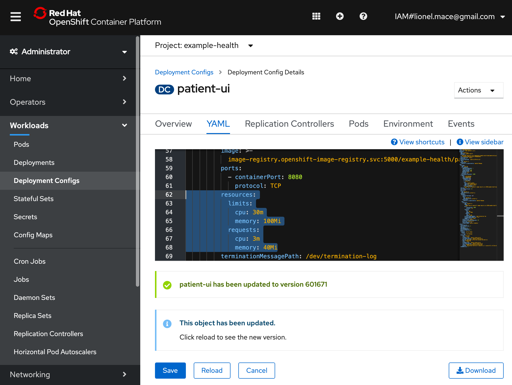

# Exercise 4: Scaling the application

In this exercise, we'll leverage the metrics we've observed in the previous step to automatically scale our UI application in response to load.

## Enable Resource Limits

Before we can setup autoscaling for our pods, we first need to set resource limits on the pods running in our cluster. Limits allows you to choose the minimum and maximum CPU and memory usage for a pod.

Hopefully you have your running script simulating load \(if not go [here](exercise-2.md#simulate-load-on-the-application)\), Grafana showed you that your application was consuming anywhere between ".002" to ".02" cores. This translates to 2-20 "millicores". That seems like a good range for our CPU request, but to be safe, let's bump the higher-end up to 30 millicores. In addition, Grafana showed that the app consumes about `25`-`35` MB of RAM. Set the following resource limits for your deployment now.

Navigate to `Workloads > Deployment Configs` in the left-hand bar. Then, choose `Actions > Edit Deployment Config`.


In the YAML editor, scroll down to the section `template > spec > containers` \(line 62\). Add the following resource limits into the empty resources.

```yaml
resources:
  requests:
    memory: 40Mi
    cpu: 3m
  limits:
    memory: 100Mi
    cpu: 30m
```


> Remember to set the correct unit -- millicores and MB \(not MiB\)

Hit `Reload` to see the new version.

Verify that the replication controler has ben changed by navigating to **Events**



## Enable Autoscaler

Now that we have resource limits, let's enable autoscaler.

By default, the autoscaler allows you to scale based on CPU or Memory. The UI allows you to do CPU only \(for now\). Pods are balanced between the minimum and maximum number of pods that you specify. With the autoscaler, pods are automatically created or deleted to ensure that the average CPU usage of the pods is below the CPU request target as defined. In general, you probably want to start scaling up when you get near `50`-`90`% of the CPU usage of a pod. In our case, let's make it `1`% to test the autoscaler since we are generating minimal load.

Navite to `Workloads > Horizontal Pod Autoscalers`, then hit `Create Horizontal Pod Autoscaler`.


```yaml
apiVersion: autoscaling/v2beta1
kind: HorizontalPodAutoscaler
metadata:
  name: patient-hpa
  namespace: example-health
spec:
  scaleTargetRef:
    apiVersion: apps.openshift.io/v1
    kind: DeploymentConfig
    name: patient-ui
  minReplicas: 1
  maxReplicas: 10
  metrics:
    - type: Resource
      resource:
        name: cpu
        targetAverageUtilization: 1
```

Hit Create.

## Test Autoscaler

If you're not running the script from the [previous exercise](exercise-2.md#simulate-load-on-the-application), the pods should stay at 1. Check by going to the Overview page of Deployment Configs.


Start simulating load by hitting the page several times, or running the script. You'll see that it starts to scale up:


That's it! You now have a highly available and automatically scaled front-end Node.js application. OpenShift is automatically scaling your application pods since the CPU usage of the pods greatly exceeded `1`% of the resource limit, `30` millicores.

### Optional

If you're interested in setting up the CLI, [follow the steps here](../getting-started/setup_cli.md). Then, run the following command in your CLI `oc get hpa` to get information about your horizontal pod autoscaler. Remember to switch to your project first with `oc project <project-name>`.

You could have created the autoscaler with the command `oc autoscale dc/patient-ui --min 1 --max 10 --cpu-percent=1`.

