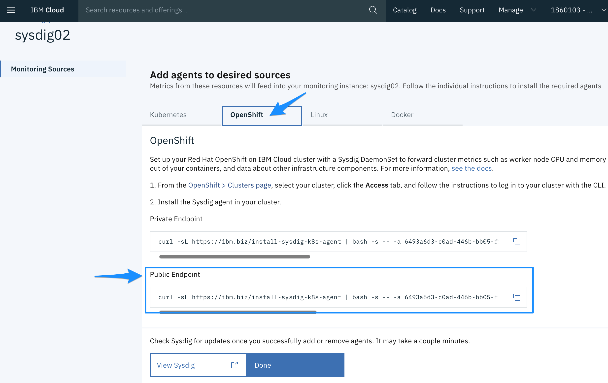

# Configure the Sysdig Agent

To integrate your monitoring instance with your OpenShift cluster, you must run a script that creates a project and privileged service account for the Sysdig agent.

 If you've been invited to a lab account where an instance of Sysdig has already been provisioned and configured, you can skip all the installation below. Retrieve your Sysdig instance by looking at the cluster name in the tags attached to the instance. 

## Create a Sysdig service instance

1. Create an instance of [IBM Cloud Monitoring with Sysdig](https://cloud.ibm.com/observe/monitoring/create) from the catalog:
   1. Set the **Service name** to **YOUR_IBM_ID-sysdig**.
   1. Select the location where your cluster is created. If the location is not in the list, pick the closest region (e.g. us-south).
   1. Use the default resource group.
   1. Click **Create**.
1. In the [**Observability** category, under Monitoring](https://cloud.ibm.com/observe/monitoring), locate the service instance you created.

## Deploy the Sysdig agent in the cluster

1. On your instance, click **Edit sources**.

1. Before running the curl command in the next step, make sure you're still logged in to the cluster. [Access your cluster using the oc CLI](../getting-started/setup_cli#access-your-cluster-using-the-oc-cli). 

1. Select the **OpenShift** tab and run the curl command next to **Public Endpoint**

    

    The Sysdig agent collects metrics such as the worker node CPU usage, worker node memory usage, HTTP traffic to and from your containers, and data about several infrastructure components.

## Verify that the Sysdig agent is deployed successfully

Verify that the `sydig-agent` pods on each node have a **Running** status.

Run the following command:

```text
oc get pods -n ibm-observe
```

Example output:

```text
    NAME                 READY     STATUS    RESTARTS   AGE
    sysdig-agent-qrbcq   1/1       Running   0          1m
    sysdig-agent-rhrgz   1/1       Running   0          1m
```


